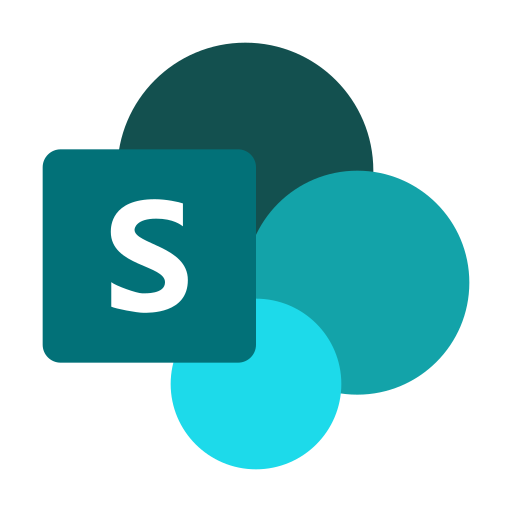

<div align="center">

&nbsp;&nbsp;&nbsp;&nbsp;&nbsp;&nbsp;&nbsp;&nbsp;

<h1>Microsoft MCP</h1>

<p>
  <b>Model Context Protocol servers for Microsoft 365.</b><br/>
  Calendar · Contacts · OneDrive · Outlook · SharePoint — on the official
  <a href="https://www.npmjs.com/package/@modelcontextprotocol/sdk"><code>@modelcontextprotocol/sdk</code></a>,
  over stdio or Streamable HTTP.
</p>

[](https://github.com/0xka13b/microsoft-mcps/actions/workflows/ci.yml)
[](https://github.com/0xka13b/microsoft-mcps/actions/workflows/ci.yml)
[](LICENSE)


</div>

Each server speaks the real MCP protocol and runs over **either transport**:

- **stdio** — for local MCP clients that launch the server as a subprocess (Claude Desktop, IDEs, the MCP Inspector).
- **Streamable HTTP** — for remote/hosted use, with the Microsoft Graph access token supplied per request via `Authorization: Bearer`.

## Servers

| | Server      | npm package (and binary)  | Tools |
| :-: | ----------- | ------------------------- | ----: |
|    | Calendar    | `ms-calendar-mcp`         |     9 |
|    | Contacts    | `ms-contacts-mcp`         |     7 |
|    | OneDrive    | `ms-onedrive-mcp`         |     9 |
|     | Outlook     | `microsoft-outlook-mcp`   |    14 |
|  | SharePoint  | `ms-sharepoint-mcp`       |    23 |

All tools are thin wrappers over the [Microsoft Graph](https://learn.microsoft.com/graph/) `v1.0` API.

## Layout

```
microsoft-mcp/
├── apps/                       # one MCP server per Microsoft 365 product
│   ├── calendar/
│   ├── contacts/
│   ├── onedrive/
│   ├── outlook/
│   └── sharepoint/
│       └── src/
│           ├── tools.ts        # declarative tool definitions (schema + handler)
│           └── index.ts        # run({ name, version }, tools)
└── packages/                   # shared building blocks
    ├── core/                   # MCP server bootstrap + dual transport (stdio / HTTP)
    ├── graph/                  # Microsoft Graph HTTP client
    ├── validation/             # id / path / query sanitizers
    └── logger/                 # structured JSON logging (stderr-only — stdio-safe)
```

A server is just a list of tools handed to `run()`:

```ts
// apps/calendar/src/index.ts
import { run } from "@microsoft-mcp/core";
import { tools } from "./tools.js";

void run({ name: "microsoft-calendar", version: "1.0.0", title: "Microsoft Calendar" }, tools);
```

```ts
// a single tool
defineTool({
  name: "get_event",
  description: "Get a single calendar event by ID.",
  inputSchema: { event_id: z.string().describe("Event ID") },
  confirmationPolicy: "never",
  handler: ({ graph }, { event_id }) => {
    validateId(event_id, "event_id");
    return graph.request("GET", `/me/events/${event_id}`);
  },
});
```

`confirmationPolicy` (`"always"` for mutating/destructive tools, `"never"` for read-only) is surfaced to clients as MCP `readOnlyHint` / `destructiveHint` annotations.

## Requirements

- Node.js >= 20
- pnpm 10 (`corepack enable`)

## Setup

```bash
pnpm install
pnpm build        # build all servers (turbo) -> apps/*/dist/index.js
pnpm check-types  # typecheck everything
```

## Tests & CI

```bash
pnpm test            # run the vitest suite once
pnpm test:watch      # watch mode
pnpm test:coverage   # run with a v8 coverage report (-> coverage/)
```

Tests live next to the code as `*.test.ts` and run on TypeScript source directly (no build step). The shared `packages/*` are covered by unit and integration tests — including a full Streamable-HTTP round-trip against a live server — and CI enforces a coverage floor on them. Each `apps/*` server ships an invariant suite that locks its tool surface (unique snake_case names, valid schemas and confirmation policies).

Every push and pull request to `master` runs [CI](.github/workflows/ci.yml): typecheck → build → tests with coverage. The coverage badge is regenerated from the run.

## Authentication

These servers do **not** run an OAuth flow; supply a pre-acquired Microsoft Graph access token.

- **stdio:** set `MICROSOFT_ACCESS_TOKEN` in the environment.
- **HTTP:** send `Authorization: Bearer <token>` on each `POST /mcp` request. Each request is handled statelessly with its own token, so multiple callers never share credentials.

For local testing you can mint a short-lived token with the Azure CLI:

```bash
az account get-access-token --resource https://graph.microsoft.com --query accessToken -o tsv
```

Copy `.env.example` to `.env` and fill in the values for local development.

## Running

### stdio (e.g. Claude Desktop)

Each server is published to npm and runnable with `npx` — no clone or build:

```jsonc
// claude_desktop_config.json
{
  "mcpServers": {
    "microsoft-calendar": {
      "command": "npx",
      "args": ["-y", "ms-calendar-mcp"],
      "env": { "MICROSOFT_ACCESS_TOKEN": "<token>" }
    }
  }
}
```

Or point at a local build instead of npm:

```jsonc
{
  "command": "node",
  "args": ["/abs/path/microsoft-mcp/apps/calendar/dist/index.js"],
  "env": { "MICROSOFT_ACCESS_TOKEN": "<token>" }
}
```

During development you can skip the build and run the TypeScript directly:

```bash
MICROSOFT_ACCESS_TOKEN=<token> pnpm --filter ms-calendar-mcp dev
```

### Streamable HTTP

```bash
# build first, then:
PORT=3000 node apps/calendar/dist/index.js --http
# or, in dev:
pnpm --filter ms-calendar-mcp dev -- --http --port 3000
```

The server exposes `POST /mcp` (the MCP endpoint) and `GET /healthz`. Point any Streamable-HTTP MCP client at `http://localhost:3000/mcp` with an `Authorization: Bearer` header.

## Transport selection

Resolved in this order: `--stdio` / `--http` flag → `MCP_TRANSPORT=stdio|http` → default `stdio`.
HTTP port: `--port <n>` → `PORT` → `3000`.

## Environment variables

| Variable                  | Used by | Description                                                        |
| ------------------------- | ------- | ------------------------------------------------------------------ |
| `MICROSOFT_ACCESS_TOKEN`  | stdio   | Microsoft Graph access token.                                      |
| `MCP_TRANSPORT`           | both    | `stdio` (default) or `http`.                                       |
| `PORT`                    | http    | Listen port (default `3000`).                                      |
| `MCP_HTTP_BODY_LIMIT`     | http    | Max request body size (default `50mb`) for base64 uploads.         |
| `MCP_DEBUG`               | both    | Any non-empty value enables debug logs (to stderr).                |

## Adding a server

```bash
pnpm new-app <name>
```

Scaffolds `apps/<name>/` from the standard template (package.json, tsconfig, tsup config, and a starter `src/tools.ts` + `src/index.ts`). Then add your tools and run `pnpm install`. The template is already publish-ready.

## Releasing

Each server is an independent, unscoped npm package (`ms-<service>-mcp`). The shared `packages/*` are `private` — `tsup` bundles them into each server's `dist/index.js` (`noExternal: [/^@microsoft-mcp\//]`), so only `@modelcontextprotocol/sdk`, `express`, and `zod` are installed at runtime.

Versioning uses [changesets](https://github.com/changesets/changesets); publishing uses `pnpm -r publish`:

```bash
pnpm changeset           # describe a change; pick affected servers + bump type
pnpm version-packages    # apply pending changesets -> bump versions + changelogs
pnpm release             # build all, then `pnpm -r publish` to npm
```

`pnpm -r publish` rewrites the internal `workspace:*` deps to real versions, runs `prepublishOnly` (a fresh `tsup` build) per package, and publishes only servers whose version isn't already on npm. The packages are unscoped, so they publish public by default — just `npm login` with any account first.
